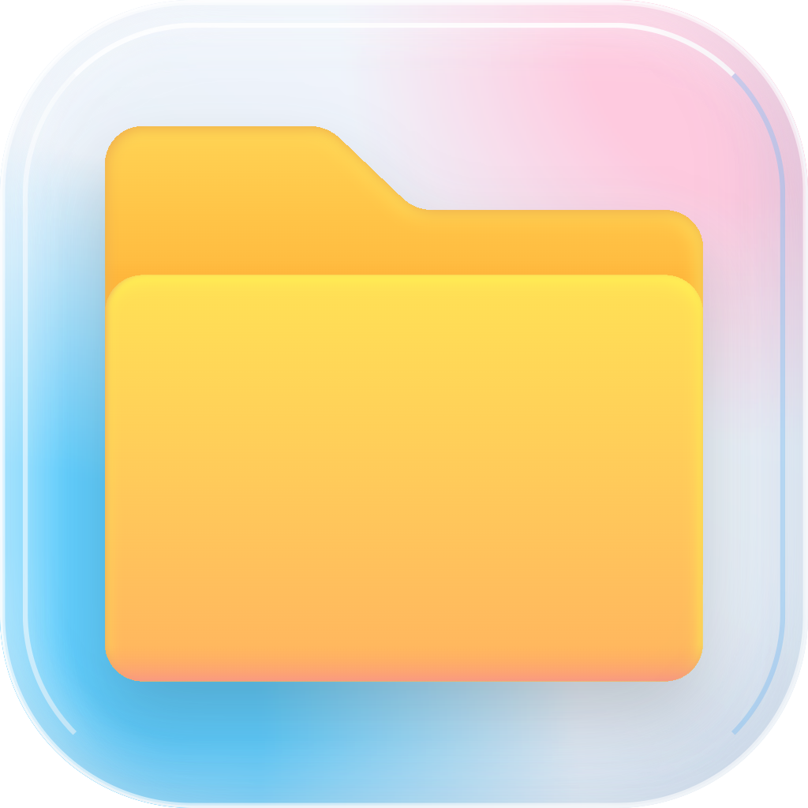
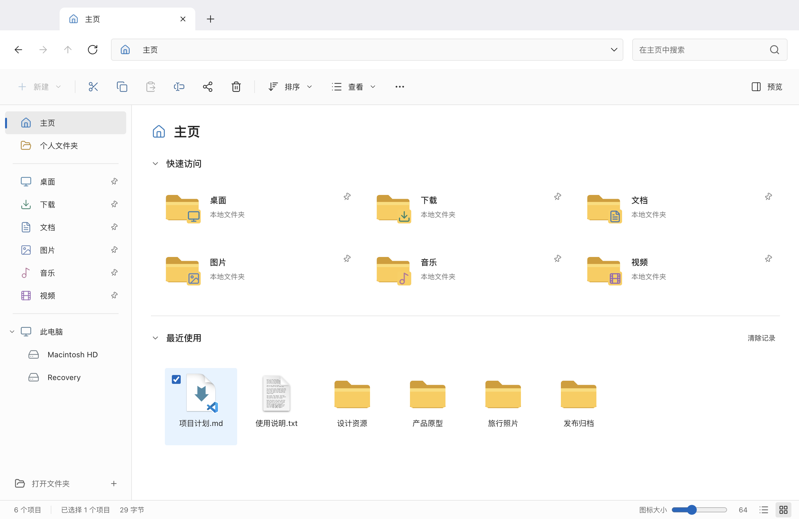
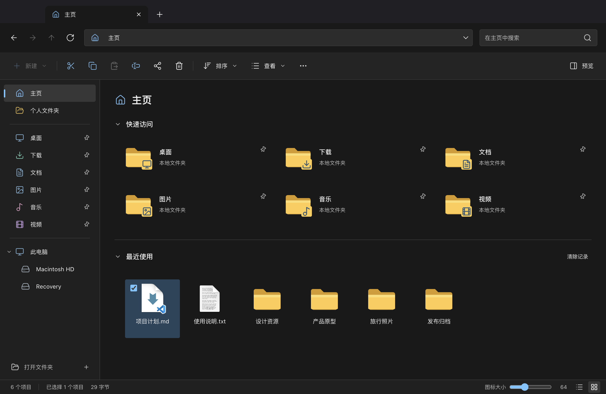

<div align="center">
  
  <h1>Mac Explorer</h1>
  <p><strong>换了 Mac，文件管理习惯不用换。</strong></p>
  <p>A Windows-style file manager for macOS.</p>
  <p>
    <a href="https://github.com/qixiaoyu27/Mac-Explorer/releases/latest"></a>
    
    
    <a href="LICENSE"></a>
  </p>
  <p>
    <a href="https://github.com/qixiaoyu27/Mac-Explorer/releases/latest"><strong>下载 Mac 版</strong></a> ·
    <a href="#熟悉的操作真正的-mac-文件">功能</a> ·
    <a href="#从源码运行">开发</a> ·
    <a href="https://github.com/qixiaoyu27/Mac-Explorer/issues">反馈问题</a>
  </p>
</div>



Mac Explorer 面向习惯 Windows 文件资源管理器的 Mac 用户：熟悉的标签页、路径栏、右键菜单和快捷键，加上压缩包浏览与选择解压，让日常文件操作按你习惯的方式完成。

这是独立开发的 macOS 应用，直接管理本机文件，使用系统权限、默认应用和废纸篓。安装后与 Finder 共存，不接管系统默认文件管理器。

## 下载与安装

1. 前往 **[Releases](https://github.com/qixiaoyu27/Mac-Explorer/releases/latest)**，下载 `Mac-Explorer-版本号-mac-arm64.dmg`。
2. 打开 DMG，将 **Mac Explorer** 拖入 **Applications**。
3. 启动应用，按需允许访问桌面、文档或下载文件夹。

| 平台 | 支持情况 |
| --- | --- |
| Apple Silicon（M 系列芯片） | 提供 DMG 安装包与 ZIP 便携包 |
| 系统版本 | 构建目标为 macOS 13+；最低版本尚未在实机回归 |
| Intel Mac / Windows / Linux | 暂未提供构建 |

正式发布包经过 **Developer ID 签名、Apple 公证与票据装订**；每次发布附带 `SHA256SUMS.txt`。从同一 Release 下载校验文件后，可运行 `shasum -a 256 -c SHA256SUMS.txt` 校验对应下载文件；只下载一个安装包时，另一个未下载文件会提示不存在。

## 熟悉的操作，真正的 Mac 文件

| 你熟悉的习惯 | Mac Explorer 的实现 |
| --- | --- |
| 多窗口来回切换 | 多标签浏览，保留标签位置，支持前进、后退和上一级 |
| 在路径栏直接输入 | 单击当前路径即可编辑；面包屑可快速跳转上级目录 |
| 按自己的方式看文件 | 八种视图、32–128 px 图标调节、Retina 图标、排序与紧凑视图 |
| 勾选多个文件再操作 | 开启项目复选框后，悬停时显示，勾选后保持显示 |
| 常用目录随手可达 | 快速访问固定与取消固定，默认目录也可取消 |
| 右键完成日常任务 | 新建、重命名、复制、剪切、粘贴、ZIP 压缩、选择打开方式、打开终端 |
| 不打开文件也能看内容 | 文本和图片预览、详细信息窗格、Space 调用 macOS 快速查看 |
| 从其他应用跳到文件 | 接收系统“打开方式”请求：进入文件夹，或定位并选中文件 |

### 压缩包：先看看，再解压

把常用的 WinRAR 操作习惯带到 Mac：

- **双击压缩包**：直接浏览目录，进入包内子文件夹。
- **双击包内文件**：提取临时副本，交给默认应用打开。
- **勾选部分或全部项目**：解压到指定路径、当前路径，或以压缩包实际名称创建的文件夹。
- **右键压缩包**：直接解压到当前目录或同名文件夹。
- **选中文件或文件夹右键**：压缩为 ZIP；多选可合并成一个包。

解压保留目录结构；已有同名顶层项目会整项跳过，不合并、不覆盖。包内文件的临时副本修改后**不会写回压缩包**，请另存需要保留的内容。

ZIP、TAR.GZ、7z 已通过测试；其他格式（包括 RAR）取决于 macOS 自带 libarchive。当前不支持密码、分卷包、归档内链接或特殊文件。

### 浅色、深色，或跟随系统

在 **更多（…）→ 外观** 中切换；在 **查看 → 显示** 中调整导航窗格、紧凑视图、复选框、文件扩展名和隐藏项目。设置会自动保存。

<details>
<summary>查看深色界面</summary>



</details>

*以上截图来自实际应用，使用演示文件，不包含个人数据。*

## 快捷键

常用文件操作同时支持 **Ctrl** 和 **Command（⌘）**。Mac 上的 Alt 对应 Option；部分键盘的 F2、F5 需要配合 Fn。

| 操作 | 快捷键 |
| --- | --- |
| 复制 / 剪切 / 粘贴 / 撤销 | Ctrl+C / X / V / Z |
| 全选 / 新建文件夹 | Ctrl+A / Ctrl+Shift+N |
| 重命名 / 移到废纸篓 | F2 / Delete 或 ⌘+Backspace |
| 打开 / 快速查看 | Enter / Space |
| 编辑路径 / 搜索 | Ctrl+L / Ctrl+F |
| 前进 / 后退 / 上一级 | Alt+→ / Alt+← / Alt+↑ |
| 新建 / 关闭 / 切换标签页 | Ctrl+T / Ctrl+W / Ctrl+Tab |
| 刷新 / 详细信息窗格 | F5 或 Ctrl+R / Alt+Enter 或 ⌘+I |

## 与其他应用配合

安装后，可在支持 macOS 标准“打开方式”的应用中选择 Mac Explorer；不同应用可能会筛选显示的文件类型。也可以从终端打开：

```sh
open -a 'Mac Explorer' '/完整的文件或文件夹路径'
```

<details>
<summary>在 Codex 中添加“Mac Explorer”打开方式</summary>

将 [PNG 图标](design/icon-selected-mirrored.png) 保存到固定位置，然后在 `~/.codex/config.toml` 中添加以下配置。将 `icon` 改为图标的实际绝对路径；应用路径也应与你的安装位置一致。

```toml
[desktop.custom_file_handlers.mac_explorer]
label = "Mac Explorer"
icon = "/完整路径/mac-explorer.png"
command = "/usr/bin/open"
args = ["-a", "/Applications/Mac Explorer.app"]
input = "path"
supports_ssh = false
```

重启 Codex 后生效。参见 [Codex 自定义文件处理器文档](https://learn.chatgpt.com/docs/config-file/config-advanced#add-custom-file-handlers)。

</details>

## 文件安全与当前边界

- 同名目标不覆盖；批量操作分别报告成功项和失败项。删除进入 macOS 废纸篓。
- 撤销支持本次应用会话中的新建、复制、移动和重命名；废纸篓恢复交给系统处理，删除会清空应用内撤销历史。
- 访问权限由 macOS 管理。遇到权限提示，可到“系统设置 → 隐私与安全性 → 文件与文件夹”检查授权。
- 搜索按文件名递归，最多扫描 30,000 项、返回 1,000 项；不递归跟随符号链接或进入应用包。
- 文本预览上限 16 KB，图片 12 MB；归档目录上限 10,000 项，解压上限 20 GB / 5 分钟。

尚未实现 Windows Shell 扩展、OneDrive 集成、Windows 网络发现、分组、框选、列宽拖动、重做与批量重命名。项目仍在持续完善，不宣称 Windows 资源管理器的完整功能兼容。

## 从源码运行

需要 **macOS、Apple Silicon、Node.js 22.12+ 和 Xcode Command Line Tools**。原生图标服务使用 Swift，归档目录服务使用 C / libarchive。

```sh
git clone https://github.com/qixiaoyu27/Mac-Explorer.git
cd Mac-Explorer
npm ci
npm run dev
```

| 命令 | 用途 |
| --- | --- |
| `npm run build` | TypeScript 检查、前端打包、原生组件编译 |
| `npm test` | 临时目录中的文件系统回归测试 |
| `npm run test:ui` | Electron 文件操作与键盘流程 |
| `npm run test:view` / `npm run test:theme` | 视图、复选框、外观与设置保存 |
| `npm run test:icons` | 图标分辨率、尺寸和路径编辑 |
| `npm run test:archive` / `npm run test:compression` | 归档浏览、解压、压缩与文件保留 |
| `npm run test:external` | 外部路径打开、文件定位与请求排队 |
| `npm run package` | 本机体验包：ad-hoc 签名，未公证 |
| `npm run package:release` | Developer ID 签名、公证、DMG / ZIP 与 SHA-256 校验文件 |

正式打包需通过环境变量提供 `CSC_NAME`（签名身份名称）和 `APPLE_NOTARY_PROFILE`（已保存在钥匙串中的公证配置名）；自定义签名钥匙串可设置 `CSC_KEYCHAIN`。构建不会自动上传 GitHub，签名或公证失败会停止。请勿把证书、私钥或凭证提交到仓库。

```text
src/          React 界面、样式与主题
electron/     文件操作、原生服务与隔离预加载桥接
shared/       IPC 类型与归档格式规则
tests/        文件系统测试
scripts/      开发、构建、签名与桌面回归测试
docs/images/  使用演示文件拍摄的应用截图
```

## 参与贡献

欢迎通过 [Issues](https://github.com/qixiaoyu27/Mac-Explorer/issues) 提交问题或建议。报告问题时请附上应用版本、macOS 版本、复现步骤和脱敏截图；涉及文件操作时，尽量提供可复现的演示文件。

提交 PR 前请阅读 [贡献指南](AGENTS.md) 和 [界面设计约定](DESIGN.md)，完成构建及相关测试。界面改动请附截图，文件操作测试请使用临时目录。

## 许可证与致谢

以 [GNU GPL v3](LICENSE) 开源。基于 Electron、React、Lucide 和 macOS 原生能力构建。

外观与交互受 Windows 11 File Explorer 启发，归档流程参考 WinRAR 使用习惯。Mac Explorer 与 Microsoft、Apple、WinRAR 均无隶属或官方合作关系。
